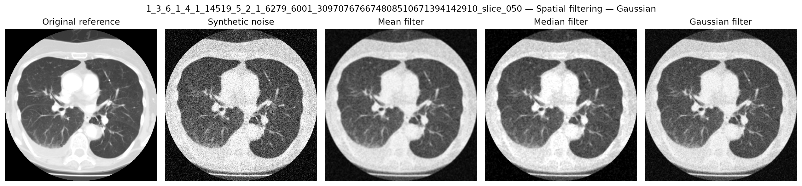
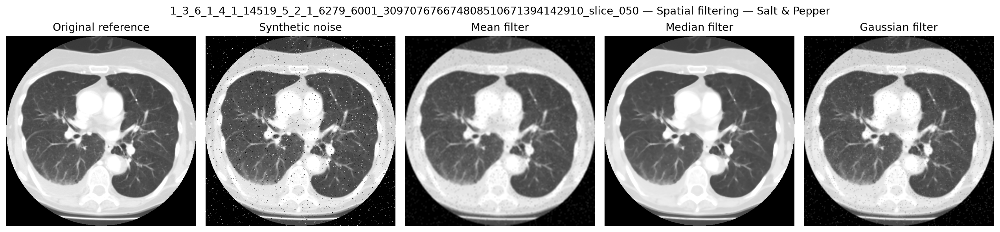
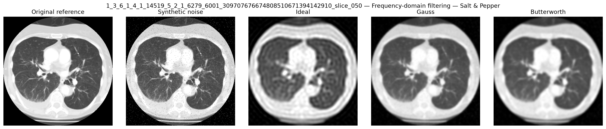
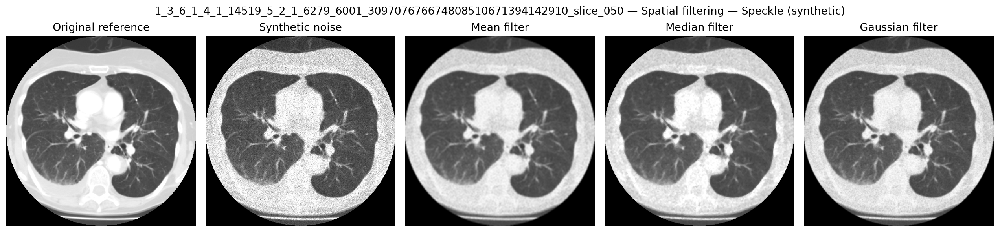

# 🔬 Biomedical Image Denoising Suite


An interactive Streamlit application dedicated to **medical image denoising experiments and low-pass filtering** (X-rays, MRI, DICOM CT scans). This platform quantitatively evaluates (PSNR, SSIM) **spatial** (*Mean, Median, Gaussian*) and **frequency** (*Ideal, Gaussian, Butterworth* via 2D FFT) low-pass filters, including DICOM handling based on relevant metadata and standard concepts (Hounsfield unit conversion, DICOM windowing using Window Center / Window Width, photometric interpretation handling).

---

## 📌 Table of Contents

- [Overview & Architecture](#-overview--architecture)
- [Scientific Foundations & Algorithms](#-scientific-foundations--algorithms)
- [Complete DICOM Pipeline](#-complete-dicom-pipeline)
- [Tech Stack](#-tech-stack)
- [Installation & Usage](#-installation--usage)
- [Test Suite & Continuous Integration](#-test-suite--continuous-integration)

---

## 🏗️ Overview & Architecture

The project separates the 2D processing pipeline from the Streamlit interface and keeps the optional 3D DICOM workflow in `src/`.

```text
biomedical-image-denoising-suite/
├── .github/
│   └── workflows/
│       └── pytest.yml       # Automated test workflow on pushes and pull requests
├── app.py                   # Streamlit interface for 2D experiments
├── filters.py               # 2D image loading, filtering, and metrics
├── evaluate_denoising.py    # DICOM CT slice benchmark + 2D figure exports
├── download_data.py         # Local sample generation and downloads
├── test_filters.py          # 2D unit tests
├── test_volume_denoising.py # 3D denoising unit tests
├── src/                     # DICOM volume, denoising, and visualization code
├── requirements.txt         # Project dependencies
└── samples/                 # Optional UI/demo images; not the main CT benchmark

```

### Design Conventions

* **Unified Normalization**: All images processed by `filters.py` are represented as 2D `float64` NumPy arrays bounded within the $[0.0, 1.0]$ range.
* **Decoupled Computation**: The `filters.py` module has zero dependencies on Streamlit. Metrics (PSNR, SSIM) and Fourier spectra (unnormalized 2D FFT) can be directly integrated into batch processing workflows or Jupyter notebooks.

---

## 🔬 Scientific Foundations & Algorithms

### Low-Pass Filtering Mechanism

Different noise processes have different spatial and frequency characteristics. Low-pass filtering can attenuate high-frequency components, but it may also remove fine anatomical or image structure, so the result depends on the image and noise model.

### Spatial vs. Frequency Domain

| Domain | Algorithm | Characteristics |
| --- | --- | --- |
| **Spatial** | **Mean (Box)** | Uniform smoothing via $O(K^2)$ spatial convolution. Significantly blurs anatomical edges. |
| **Spatial** | **Median** | Non-linear filter. Effective for impulse outliers such as Salt & Pepper noise and can preserve edges better than simple averaging in some cases. |
| **Spatial** | **Gaussian** | Weighted spatial kernel. Smoothes noise while minimizing structural artifacts. |
| **Frequency** | **Ideal** | Sharp circular binary mask on 2D FFT. Introduces prominent **ringing artifacts (Gibbs phenomenon)** around edges. |
| **Frequency** | **Butterworth** | Smooth attenuation controlled by filter order $n$. Balances roll-off steepness and ringing suppression. |
| **Frequency** | **Gaussian** | Smooth frequency attenuation without the sharp cutoff of the Ideal filter. |

### Evaluation Metrics

* **PSNR (Peak Signal-to-Noise Ratio)**: Derived from the Mean Squared Error (MSE) relative to the clean reference image.
* **SSIM (Structural Similarity Index)**: Evaluates luminance, contrast, and local structural similarity between a reference and processed image.

---

## 🩺 DICOM and 3D CT Pipeline

Medical image ingestion (`.dcm`) handles common DICOM metadata used in this project:

1. **Photometric Interpretation**: The quantitative DICOM modality values are not inverted for `MONOCHROME1`. The 2D display loader applies display-polarity inversion only after modality transformation and window normalization.
2. **Modality LUT (HU Conversion)**: Rescale slope and intercept application:

$$\text{HU} = \text{PixelValue} \times \text{RescaleSlope} + \text{RescaleIntercept}$$


3. **Windowing**: Application of Window Center ($\text{WC}$) and Window Width ($\text{WW}$) parameters extracted from DICOM metadata:

The default linear VOI window follows the DICOM convention (including the `-0.5` center offset and `WW - 1` scaling); invalid widths are rejected.


---

## 🧰 Tech Stack

* **Web Interface**: `Streamlit`
* **Image processing**: `NumPy`, `OpenCV`, `scikit-image`, `SciPy`
* **Medical imaging**: `pydicom`
* **3D visualization**: `VTK`, `Matplotlib`
* **Benchmarking**: `Pandas`
* **Testing and CI**: `pytest`, `pytest-cov`, `GitHub Actions`

---

## ⚡ Installation & Usage

### 1. Clone & Environment Setup

```bash
git clone https://github.com/ghada-59/biomedical-image-denoising-suite.git
cd biomedical-image-denoising-suite

python -m venv .venv
# Windows
.venv\\Scripts\\activate
# Linux/macOS
# source .venv/bin/activate
python -m pip install --upgrade pip
python -m pip install -r requirements.txt

```

### 2. Sample Generation & Application Launch

```bash
# Generate the built-in sample images and DICOM test files
python download_data.py

# Launch the interactive Streamlit dashboard
streamlit run app.py

```

---

## 📈 Reproducible 2D CT benchmark

The primary 2D benchmark uses representative axial slices from a local DICOM CT series, rather than treating the two sample PNG files as the project's clinical reference set. The `brain_mri.png` and `cells_tissue.png` files remain optional examples for the Streamlit interface only.

On CT, the script converts modality values to a fixed lung display window (default: center -600 HU, width 1500 HU), normalizes the displayed slice to [0, 1], adds reproducible synthetic noise, and compares classical spatial/frequency filters with the original windowed source slice. These metrics measure recovery from a controlled synthetic perturbation; the clinical CT slice is not claimed to be a noise-free ground truth.

```bash
# Use a single DICOM series directory
python evaluate_denoising.py --dicom-series data/tcia/LIDC-IDRI-0709/1.3.6.1.4.1.14519.5.2.1.6279.6001.309707676674808510671394142910

# Optional: select exact zero-based axial slice indices
python evaluate_denoising.py --dicom-series path/to/one_dicom_series --slice-indices 20 35 50 65 80 --repeats 3 --seed 42
```

The script selects up to five spread-out slices by default and evaluates three independently seeded synthetic-noise realizations per slice and noise type (configurable with `--repeats`). The summary CSV includes means and standard deviations across runs. It creates:

- `reports/denoising_benchmark.csv`: per-slice and per-filter metrics and gains relative to the unfiltered noisy input.
- `reports/denoising_summary.csv`: mean PSNR/SSIM and mean gains by filter and noise type.
- `reports/2D/`: image comparisons for spatial and frequency-domain filters.

The `reports/` directory is generated locally and is intentionally ignored by Git. Add only selected, clearly labeled result figures to the repository if they are useful in the README or portfolio.

### Representative Visual Results

The following figures illustrate representative results from the controlled
synthetic-noise benchmark on axial CT slices. Each comparison includes the
original windowed reference, the synthetically degraded image, and the filtered
outputs.

#### Gaussian Synthetic Noise — Spatial Filtering



#### Salt-and-Pepper Noise — Spatial Filtering



#### Salt-and-Pepper Noise — Frequency-Domain Filtering



#### Synthetic Speckle Noise — Spatial Filtering



### Quantitative Results

Historical pilot metrics from the earlier single-realization version (retained for context; do not compare them directly with the updated multi-realization benchmark):

| Synthetic noise | Noisy PSNR (dB) | Noisy SSIM | Median filter PSNR (dB) | Median filter SSIM |
|---|---:|---:|---:|---:|
| Gaussian | 18.376 | 0.1702 | 28.086 | 0.6048 |
| Salt & Pepper | 21.070 | 0.6259 | 36.007 | 0.9711 |
| Speckle (synthetic) | 22.450 | 0.4845 | 31.106 | 0.8169 |

In that preliminary pilot, the Median filter achieved the highest mean PSNR among
the spatial filters for all three noise types. Re-run the updated benchmark after
downloading this revision before reporting current metrics. Its CSV output records
each run's seed and reports across-run standard deviations.

**Evaluation limitation:** The reference is the original CT slice before
synthetic noise was added. These results measure recovery under controlled
synthetic perturbations; they do not establish performance on unknown real
clinical noise or demonstrate clinical diagnostic benefit.

### Dataset attribution

The local TCIA LIDC-IDRI CT series is not bundled in this repository. The 3D volume loader rejects mixed-series directories, inconsistent orientations and non-uniform slice spacing rather than silently constructing a misleading regular grid. When using LIDC-IDRI, follow the dataset's attribution and data-use requirements. Reference: Armato SG III et al., *Data From LIDC-IDRI*, The Cancer Imaging Archive (2015), DOI: [10.7937/K9/TCIA.2015.LO9QL9SX](https://doi.org/10.7937/K9/TCIA.2015.LO9QL9SX). See the [official TCIA collection page](https://www.cancerimagingarchive.net/collection/lidc-idri/).

## 🧪 Test Suite & Continuous Integration

The test suite covers noise generation, input validation, filtering, numerical metrics, DICOM loading/sorting, physical spacing, geometry checks, CT window normalization, and reproducible seed derivation. GitHub Actions runs this test suite automatically on pushes and pull requests targeting `main`.

```bash
# Run the full test suite
python -m pytest -q

# Optional coverage report
python -m pytest --cov=filters --cov-report=term-missing
```

### Important evaluation note

PSNR and SSIM are computed against the **loaded reference image**. When synthetic noise is added in the application, that reference is the original image before degradation, so the comparison has a known reference. For an already-noisy real image uploaded without a ground-truth clean counterpart, these metrics measure similarity to the uploaded image rather than objective restoration accuracy.

The included DICOM samples are public test files or locally generated synthetic data. The larger CT dataset used for the 3D experiments is not committed to the repository. Dataset access, attribution, and redistribution terms must be respected.


## ⚠️ Scope and limitations

This is an educational image-processing project, not a clinical diagnostic tool. The implemented methods are classical spatial/frequency-domain filters and 3D Gaussian smoothing; they are not presented as state-of-the-art medical denoising methods.

PSNR and SSIM are meaningful here when synthetic noise is added to a known reference image. For real clinical images without a clean reference, the project reports descriptive changes rather than claiming denoising accuracy.

The 3D reconstruction code expects a consistent DICOM series with `ImageOrientationPatient`, `ImagePositionPatient`, `PixelSpacing`, and compatible image dimensions/series metadata.


### 3D workflow

The optional 3D tools are separate from the Streamlit app and require VTK. They preserve the DICOM direction matrix in VTK, validate single-series identity and uniform slice spacing, apply Gaussian sigma in physical millimetres, and save PNG snapshots. They operate on a local DICOM series directory:

```bash
# Orthogonal slice views
python -m src.slice_viewer path/to/dicom_series

# Original CT volume (neutral grayscale is the default)
python run_3d_viewer.py path/to/dicom_series --output reports/3D/original_ct_volume.png

# Optional pseudo-colour maps CT intensity only; it is not functional activity
python run_3d_viewer.py path/to/dicom_series --color-mode hu-pseudocolor

# Original vs. 3D Gaussian-smoothed volume, using the same camera and intensity mapping
python run_denoised_3d_viewer.py path/to/dicom_series --sigma-mm 1.0 --output reports/3D/original_vs_smoothed_ct.png

# Optional pseudo-colour comparison (same mapping on both volumes)
python run_denoised_3d_viewer.py path/to/dicom_series --sigma-mm 1.0 --color-mode hu-pseudocolor

# Orthogonal slice/difference figure and descriptive smoothing report
python -m src.evaluate_volume_denoising path/to/dicom_series --sigma-mm 1.0
```

The volume viewer annotates the volume dimensions, voxel spacing and display mode, and includes an orientation marker. The original/smoothed comparison shares a camera and the same intensity transfer function so that visual differences are easier to interpret. Grayscale is the default; pseudo-colour is an intensity mapping only, not a PET-like functional overlay. The 3D workflow is intended for compatible single-frame CT series and is not a clinical visualization system. Smoothing can remove small structures, so a smoother appearance alone is not evidence of improved diagnostic quality.
